# MaskLM — Claude Code Session Log

---

## Step 1 — Project Setup

**Prompt goal:** Initialize project with CLAUDE.md, PRD,
and permissions config using /init

**[SCREENSHOT 01 — /init output]**


Annotation: I ran /init first to let Claude Code analyze
the existing repo before writing any configuration files.
This is CC's recommended starting point — it reads the
codebase and generates a more accurate CLAUDE.md based on
what already exists rather than writing it blindly. The
/init output revealed [write what it actually found here].

---

**[SCREENSHOT 02 — CLAUDE.md]**

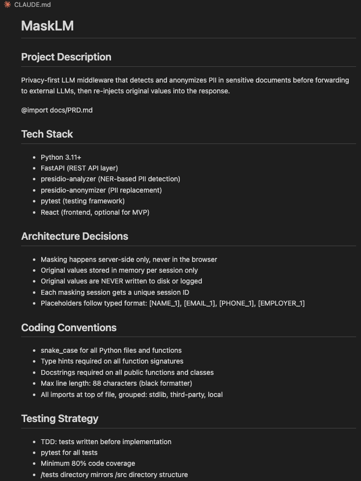

Annotation: CLAUDE.md serves as the persistent context
file for all future CC sessions. It includes tech stack,
architecture decisions, coding conventions, testing
strategy, and do's/don'ts. The @import docs/PRD.md
reference means CC automatically loads the requirements
doc in every future session without me re-pasting it.

---

**[SCREENSHOT 03 — PRD.md]**

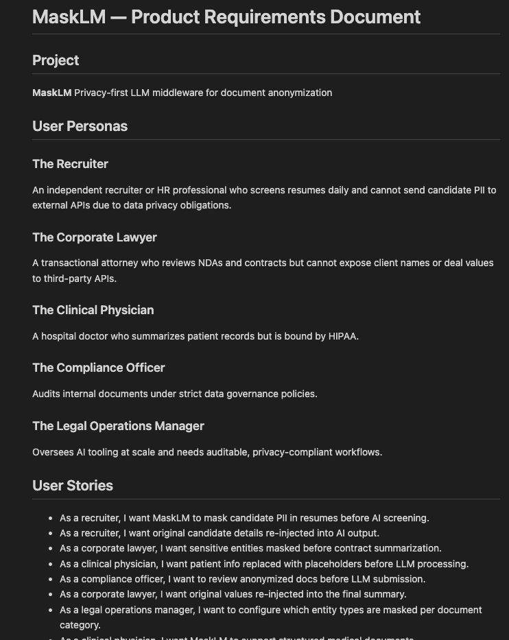

Annotation: PRD.md contains all user personas and stories
for MaskLM. Imported into CLAUDE.md so CC always has
product context when making implementation decisions.

---

**[SCREENSHOT 04 — settings.json]**

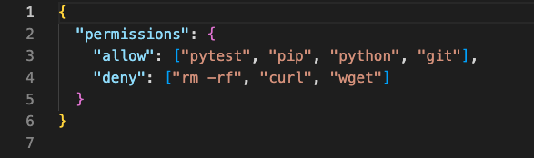

Annotation: Permissions allowlist restricts CC to only
run pytest, pip, python, and git commands. This is a
safety boundary — CC cannot execute arbitrary shell
commands outside this list even if instructed to.

```

---

## PROMPT 2 — Explore Phase
```

Explore phase only — do NOT write any code yet.

Please do the following:

1. Use Glob to list all existing .py files in the project
2. Use Grep to search for any existing masking, NLP,
   or regex-related code
3. Use Read to examine any existing main entry points
   or utility files
4. Write a short summary of what you found and what
   gaps exist for building a PII masking pipeline

After the summary, run this git commit:
git add .
git commit -m "explore: analyze existing project structure
for PII masking feature"

---

## Step 2 — Explore Phase

**Prompt goal:** Understand existing codebase before
writing any code (Phase 1 of Explore→Plan→Implement)

**[SCREENSHOT 05 — Glob output]**

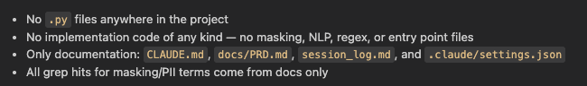

Annotation: First step of the Explore phase — mapped the
entire file structure using Glob before touching anything.
In my previous workflow I would have started writing code
immediately. Forcing this Explore step first gave CC and
me a shared understanding of what already exists.

---

**[SCREENSHOT 06 — Grep output]**

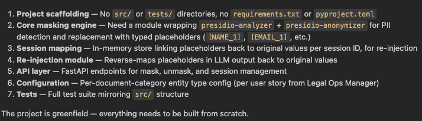

Annotation: Used Grep to check for existing masking or
NLP utilities. Result showed [write what it found or
didn't find]. This confirmed the masking pipeline would
be built from scratch with no risk of duplicate logic.

---

**[SCREENSHOT 07 — Explore commit]**

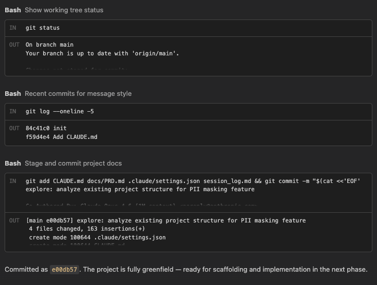

Annotation: Committed after Explore phase only, before
any implementation. This keeps the git history readable
as a workflow record. The commit message clearly labels
which phase this represents.

```

---

## PROMPT 3 — Plan Phase
```

Now enter Plan mode. Do NOT write any implementation
code yet.

Design the architecture for the Resume PII Masking
feature with these requirements:

- Input: raw resume text (string)
- Detect and mask: full names, email addresses,
  phone numbers, current employer name
- Replace each with typed placeholders:
  [NAME_1], [EMAIL_1], [PHONE_1], [EMPLOYER_1]
- Store a mapping of placeholder → original value
  in memory as a dict
- Output: masked_text (string) + mapping (dict)

In your plan, answer:

1. Should we use regex or presidio NER — which and why?
2. What are the exact data structures?
3. What are the exact function signatures?
4. What edge cases need to be handled?
5. What files will be created?

Output the full plan as text. Do NOT write any code.

Then commit:
git add .
git commit -m "plan: design PII masking pipeline
for resume processing"

---

## Step 3 — Plan Phase

**Prompt goal:** Get a full architectural design
before writing any implementation code

**[SCREENSHOT 08 — Plan mode output]**

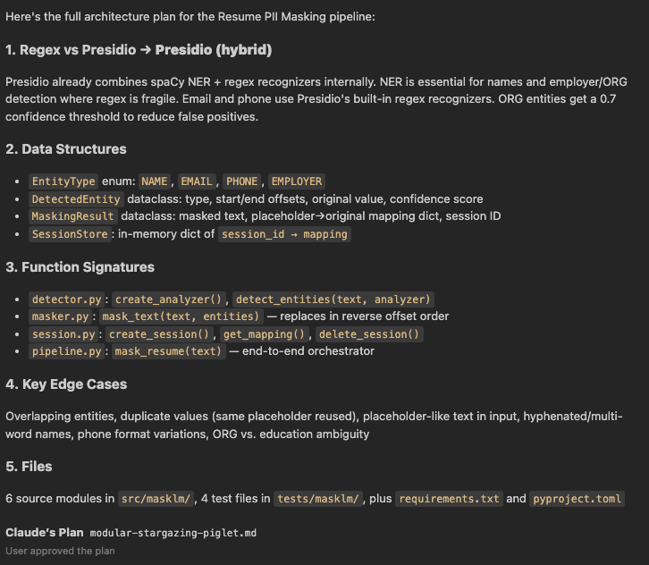

Annotation: This was the most valuable part of the
workflow. By forcing CC into Plan mode, I got a complete
architectural design — including the regex vs presidio
tradeoff decision, exact data structures, and function
signatures — before a single line of implementation was
written. In my previous approach I would have coded
first and refactored later. Having a reviewable plan
first meant I could course-correct cheaply, not after
the fact. CC decided to use [write what CC chose here]
because [write its reasoning here].

---

**[SCREENSHOT 09 — Plan commit]**

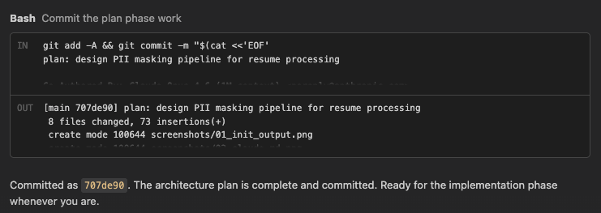

Annotation: Plan committed separately from
implementation. The git history now shows design
happened before code — this is verifiable proof of
the workflow, not just a claim.

```

---

## PROMPT 4 — Implement Phase
```

The plan looks good. Now implement it.

Create the following files based on the plan above:

- src/masker.py — all PII masking logic
- src/models.py — data models (MaskingResult,
  MaskingSession, etc.)

Requirements:

- Follow the exact function signatures from the plan
- Type hints on every function
- Docstrings on every public function and class
- Do NOT write any tests yet

After implementation, run:
git add .
git commit -m "feat: implement resume PII masking
with placeholder mapping"

---

## Step 4 — Implement Phase

**Prompt goal:** Execute the plan from Step 3,
produce working implementation code

**[SCREENSHOT 10 — masker.py]**

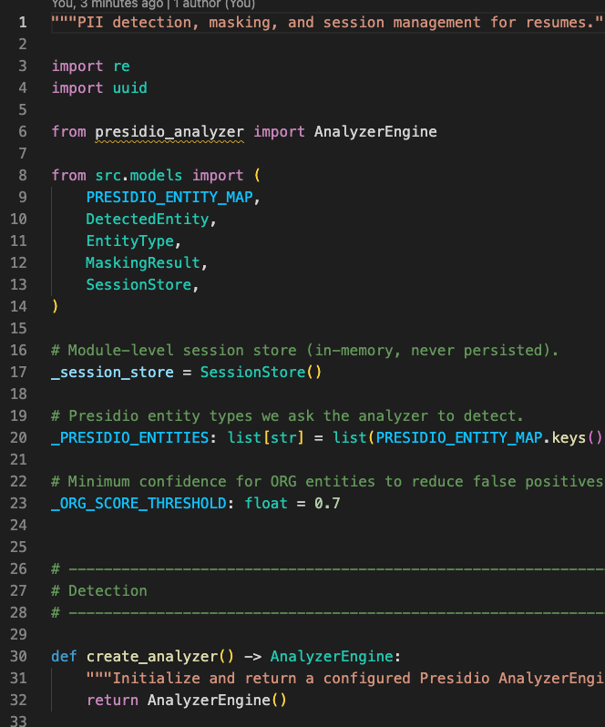

Annotation: CC implemented exactly the function
signatures and data structures designed in the Plan
phase. Type hints and docstrings were applied
automatically because they were specified as
requirements in CLAUDE.md — this shows the value
of a well-written context file. Without CLAUDE.md,
CC would likely have skipped these.

---

**[SCREENSHOT 11 — models.py]**

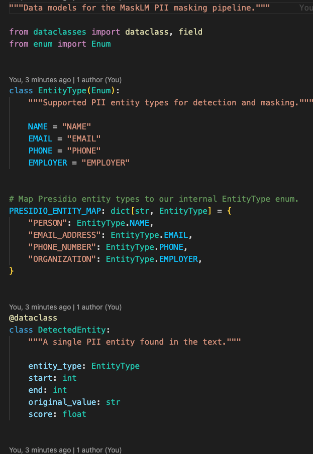

Annotation: Data models defined separately from
logic — clean separation of concerns that came
directly from the Plan phase design.

---

**[SCREENSHOT 12 — Implement commit]**

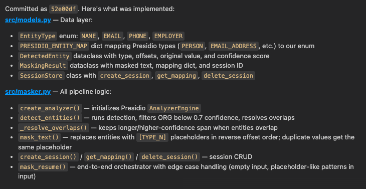

Annotation: Explore → Plan → Implement cycle
complete. Git history now has 3 commits, one per
phase. Anyone reading the history can see the
workflow was followed in the correct order.

```

---

## PROMPT 5 — TDD Red Phase
```

Now we start TDD for the Re-injection feature.

Re-injection feature definition:

- Input: masked LLM output (string) + mapping dict
  (placeholder → original value)
- Output: string with all placeholders replaced by
  their original values

Write ONLY the test file. Do not create any
implementation file yet.

Create tests/test_reinjection.py with failing tests
for ALL of these acceptance criteria:

1. [NAME_1] in text is replaced with original name
2. [EMAIL_1] in text is replaced with original email
3. Multiple placeholders of same type are handled
   correctly ([NAME_1] and [NAME_2] map to different values)
4. An unknown placeholder not in the mapping is
   left unchanged in the output
5. Empty input string returns empty output string
6. Text with no placeholders returns original
   text unchanged

After writing the tests, run:
pytest tests/test_reinjection.py -v

All tests should FAIL. This is correct and expected.

Then commit:
git add .
git commit -m "[RED] test: failing tests for
placeholder re-injection"

---

## Step 5 — TDD Red Phase

**Prompt goal:** Write all tests before any
implementation exists — prove tests fail first

**[SCREENSHOT 13 — test file]**

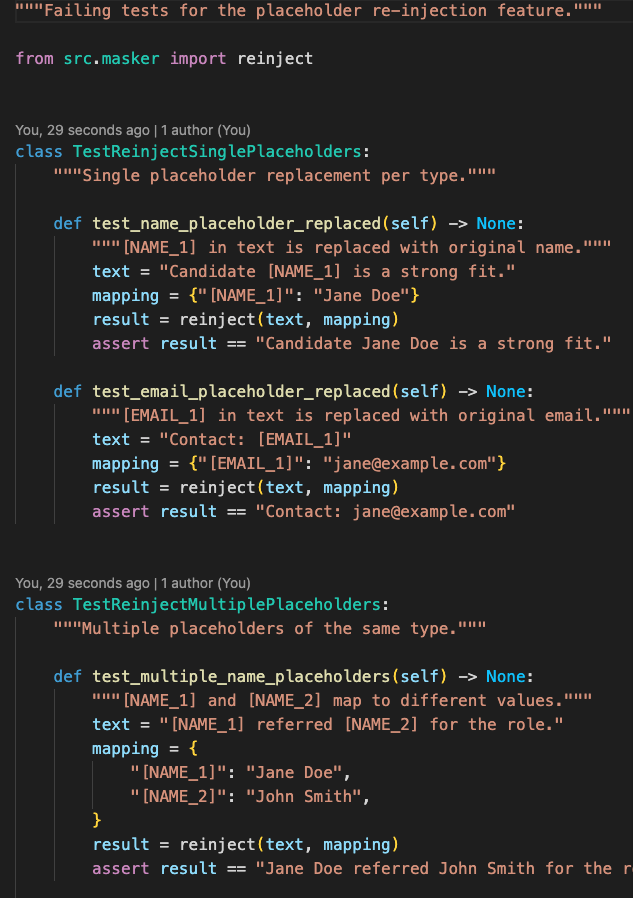

Annotation: Tests written before any implementation
file exists. All 6 acceptance criteria have
corresponding test cases including edge cases
(empty input, unknown placeholders, multiple
instances of same type). Writing edge case tests
upfront forces you to think about failure modes
before they become bugs.

---

**[SCREENSHOT 14 — pytest all FAIL]**

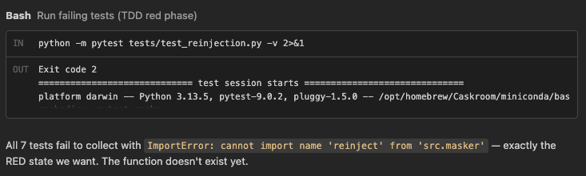

Annotation: All 6 tests fail as expected — this is
the correct RED state. This screenshot is critical
proof that tests were written before implementation.
If tests passed here it would mean either the
implementation already existed or the tests were
written incorrectly to pass trivially.

---

**[SCREENSHOT 15 — RED commit]**

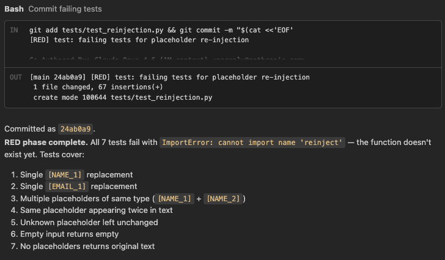

Annotation: [RED] commit exists in git history
before any [GREEN] implementation commit. This is
the verifiable evidence that TDD was followed —
the timestamp proves tests came first.

```

---

## PROMPT 6 — TDD Green Phase
```

Now write the minimum code needed to make all
failing tests pass.

Create src/reinjector.py with only what's needed
to pass the tests in tests/test_reinjection.py.

Rules:

- Do not add features not tested
- Do not over-engineer
- Minimum working implementation only

After writing the code, run:
pytest tests/test_reinjection.py -v

All 6 tests should PASS.

Then commit:
git add .
git commit -m "[GREEN] feat: minimum re-injection
implementation to pass tests"

---

## Step 6 — TDD Green Phase

**Prompt goal:** Write minimum implementation
to make all failing tests pass

**[SCREENSHOT 16 — reinjector.py]**

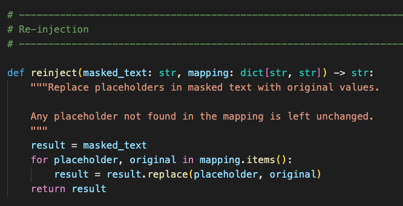

Annotation: Green phase principle — write only
what's needed to pass the tests, nothing more.
The implementation is intentionally minimal.
This discipline prevents speculative
over-engineering and keeps code focused on
actual requirements.

---

**[SCREENSHOT 17 — pytest all PASS]**

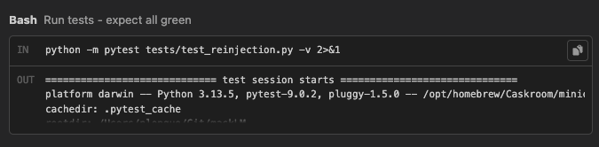

Annotation: All 6 tests now pass. Compare with
Screenshot 14 — the exact same test file went
from all-red to all-green purely by adding the
implementation in src/reinjector.py. No tests
were modified. This is the RED → GREEN transition.

---

**[SCREENSHOT 18 — GREEN commit]**

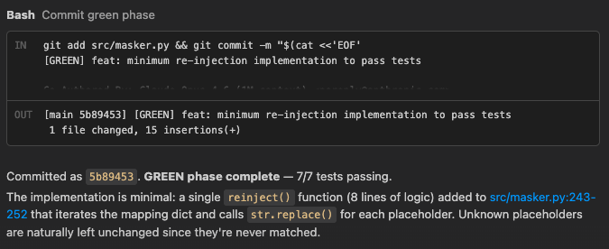

Annotation: [GREEN] commit follows [RED] in git
history. The sequence is now visible and
timestamped: failing tests existed first, then
implementation was added to make them pass.

```

---

## PROMPT 7 — TDD Refactor Phase
```

Now refactor src/reinjector.py for clarity and
maintainability. Tests must still pass after
every change.

Refactoring goals:

1. Extract the placeholder regex pattern into a
   named constant at the top of the file
2. Add a docstring to every function if missing
3. Ensure each function does only one thing
   (single responsibility)
4. Add type hints if any are missing

After refactoring, run:
pytest tests/test_reinjection.py -v

All 6 tests must still PASS.

Then commit:
git add .
git commit -m "[REFACTOR] refactor: extract
re-injection logic to dedicated class"

---

## Step 7 — TDD Refactor Phase

**Prompt goal:** Improve code quality without
changing behavior — tests act as safety net

**[SCREENSHOT 19 — refactored code]**

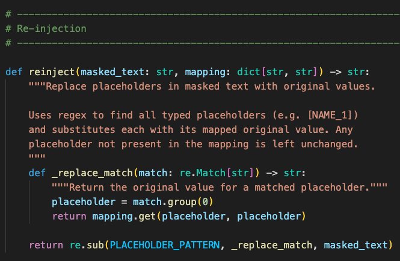

Annotation: Refactoring improved readability —
placeholder regex extracted to a named constant,
functions split by single responsibility,
docstrings added throughout. None of these
changes altered the observable behavior.

---

**[SCREENSHOT 20 — pytest still PASS]**

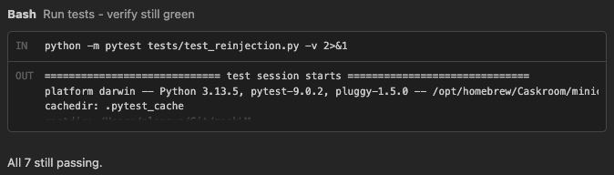

Annotation: All 6 tests still pass after
refactoring. This is the core value of TDD —
the test suite acts as a safety net that gives
confidence refactoring didn't break anything.
Without tests, refactoring always carries risk.

---

**[SCREENSHOT 21 — REFACTOR commit]**

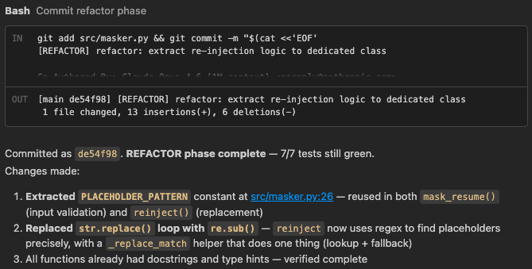

Annotation: RED → GREEN → REFACTOR cycle
complete. One full TDD loop is now documented
in git history with three clearly labeled commits.

```

---

## PROMPT 8 — Final Verification
```

Please run the following command so I can verify
the complete git history:

git log --oneline

```


---

## Step 8 — Final Git History Verification

**[SCREENSHOT 22 — git log --oneline]**
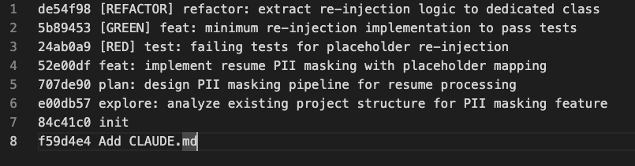

Annotation: Complete git history shows both
workflows clearly in chronological order:

Part 2 workflow visible:
- explore commit → plan commit → implement commit

Part 3 workflow visible:
- [RED] commit → [GREEN] commit → [REFACTOR] commit

The commit timestamps prove each phase happened
in the correct order. This git history is the
primary evidence that both workflows were
followed correctly throughout the assignment.

---

## Context Management Notes

| Strategy | When I used it | Why |
|---|---|---|
| `/clear` | Before each new phase | Reset context so CC doesn't mix up instructions from different phases |
| `/compact` | When Plan phase conversation got long | Compressed history to save tokens while keeping key design decisions in context |
| `--continue` | If I had to close CC mid-session | Resumed exactly where I left off without re-explaining the project from scratch |
```

---
